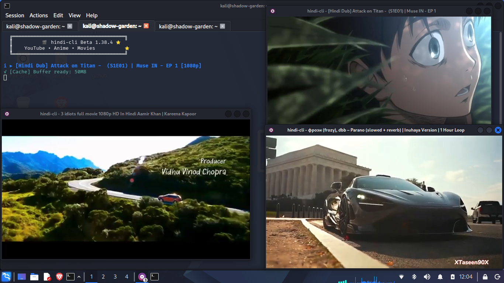

<div align="center">

# 🎬 hindi-cli

**Beta 1.38.4** — Terminal streaming utility for YouTube, Anime, and Movies

[](LICENSE)
[]()
[](https://github.com/rgkks/hindi-cli/actions/workflows/ci.yml)
[]()
[](CONTRIBUTING.md)

  ┌──────────────────────────────────────┐  
  │         🎬 hindi-cli Beta 1.38.4        │  
  │    YouTube • Anime • Movies           │  
  └──────────────────────────────────────┘  

</div>

---

## Features

- **YouTube** — Search, watch, download. History, likes, continue watching
- **Anime** — Browse episodes from official channels (Muse India, Muse Asia, Ani-One, AnimeLog)
- **Movies** — Full movies from official channels (Goldmines, Shemaroo, YRF, Premium Digiplex)
- **fzf-powered UI** — Fuzzy search, vim keys, previews, fast navigation
- **mpv player** — Hardware acceleration, subtitles, resume playback
- **Preloader** — Intelligent caching for buffer-free playback
- **Cross-platform** — Linux, macOS, Windows (Windows Terminal)
- **Plugin system** — Extend with custom providers and hooks

---

<div align="center">
  
</div>

---

## Installation

### Quick Install (Linux / macOS)

```bash
git clone https://github.com/rgkks/hindi-cli.git
cd hindi-cli
chmod +x install.sh
./install.sh
```

### Manual Install

**Dependencies:**

| Dependency | Install |
|-----------|---------|
| Python 3.8+ | `apt install python3 python3-pip` / `brew install python` |
| mpv | `apt install mpv` / `brew install mpv` |
| fzf | `apt install fzf` / `brew install fzf` |
| yt-dlp | `pip install yt-dlp` |

```bash
git clone https://github.com/rgkks/hindi-cli.git
cd hindi-cli
pip install -e .
```

### pipx (recommended)

```bash
pipx install .
hindi-cli
```

### Run without installing

```bash
./hindi-cli
```

---

## CLI Usage

```
hindi-cli                           Start interactive mode
hindi-cli --help / -h               Show help
hindi-cli --version                 Show version
hindi-cli --about                   Show about information
hindi-cli --doctor                  Run system diagnostics
hindi-cli --stats                   Show usage statistics
hindi-cli --history                 Show watch history
hindi-cli --clear-cache             Clear all cached data
hindi-cli --config                  Show config file
hindi-cli --check-update            Check for updates
hindi-cli --debug                   Run with debug logging
hindi-cli --verbose / -v            Run with verbose output
hindi-cli --no-cache                Disable preloading
hindi-cli --player mpv|vlc          Set default player
hindi-cli --quiet / -q              Suppress startup banner
hindi-cli --login                   Save YouTube cookies from browser
hindi-cli --logout                  Clear saved YouTube cookies
```

### Interactive Mode

```
┌─ Select a category ────────────────────────────┐
│  ▶  YouTube                                    │
│  🎬  Anime                                     │
│  🎥  Movies                                    │
│  🚪  Quit                                      │
└────────────────────────────────────────────────┘
```

Navigate with arrow keys or `j`/`k`, fuzzy search with `/`, select with `Enter`.

### Actions

After selecting a video:

- **Play now** — Stream with mpv
- **Download** — Save to `~/Downloads/`
- **Copy URL** — Copy video URL to clipboard
- **Open in browser** — Open in default browser
- **Like** — Save to favorites

---

## Key Bindings

| Key | Action |
|-----|--------|
| `↑`/`↓` or `k`/`j` | Navigate |
| `Enter` | Select |
| `Esc` / `Ctrl-C` | Back / Quit |
| `/` | Fuzzy search |
| `Ctrl-P` / `Ctrl-N` | Preview scroll |
| `Alt-V` | Toggle preview |

---

## Configuration

Config file: `~/.config/hindi-cli/config.json`

```json
{
  "player": {
    "default": "mpv",
    "quality": "720p",
    "mpv_args": [...]
  },
  "ui": {
    "theme": "dark"
  },
  "behavior": {
    "history_size": 500
  },
  "preload": {
    "enabled": true,
    "threshold_mb": 50,
    "max_cache_mb": 2048
  }
}
```

---

## Project Structure

```
hindi-cli/
├── main.py              # Entry point + CLI
├── version.py           # Centralized version
├── pyproject.toml       # Modern packaging
├── install.sh           # Installer
├── core/                # Config, database, fzf, plugin
├── providers/           # YouTube, Anime, Movies
├── ui/                  # Menu, Status
├── utils/               # Cache, logger, platform, preloader
└── tests/               # Test suite (66+ tests)
```

---

## Troubleshooting

**"fzf not found"** — Install fzf: `sudo apt install fzf` / `brew install fzf`

**"mpv not found"** — Install mpv: `sudo apt install mpv` / `brew install mpv`

**"yt-dlp not found"** — `pip install yt-dlp`

**No search results** — Check your internet connection. Some YouTube channels may be geo-blocked.

**Preloader fails / times out** — Run with `--debug` to see detailed logs. Try `--no-cache` to disable preloading.

---

## FAQ

**Q: What's the difference between progressive and DASH formats?**
A: Progressive formats download a single file (video+audio together). DASH downloads separate video/audio streams and merges them. Progressive is faster but limited to 720p on YouTube. hindi-cli uses progressive for preloading and DASH for streaming.

**Q: How does the preloader work?**
A: When you play a video, hindi-cli starts downloading the first 50MB in the background using yt-dlp. If the download finishes before mpv starts, it plays from the local file. Otherwise, it streams directly and the cached file is cleaned up after playback.

**Q: Can I use VLC instead of mpv?**
A: Yes: `hindi-cli --player vlc` or set `"default": "vlc"` in config.

---

## Roadmap

- [ ] Playlist/queue support
- [ ] Download manager with batch queue
- [ ] Playlist/queue support
- [ ] Download manager with batch queue
- [ ] Thumbnail previews in fzf (kitty/ueberzugpp)
- [ ] Configurable key bindings
- [ ] Subtitles search and download
- [ ] Audio-only mode enhancements
- [ ] Android (Termux) support improvements
- [ ] Windows native installer (scoop/winget)

---

## Contributing

Contributions are welcome! See [CONTRIBUTING.md](CONTRIBUTING.md) for guidelines.

---

## License

MIT License — see [LICENSE](LICENSE) for details.
